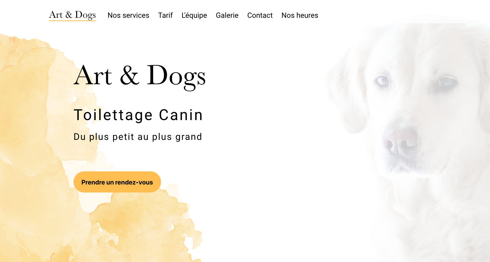

# Art and Dogs website

## What is it?

Website for the groomer Daniele Snijers, to introduce her business and allow clients to contact her.

## How?

Made in react.

## Who?
- Programmed with ❤️ by [Maxim Berge](https://www.linkedin.com/in/maxim-berge-94b486179/)
- Designed with ❤️ by [Cassandra Caestecker](https://www.linkedin.com/in/cassandra-caestecker/)

## Screenshot


## Communication with Back-end
The contact form is linked to a Firebase DB.
Use you own Firebase key to make it run.


## Project installation
### With NPM
```bash
npm install
```

### With yarn
```bash
yarn install
```

## Run project (development)
### With NPM
```bash
npm start
```

### With yarn
```bash
yarn run start
```

## Build optimised code for productions
### With NPM
```bash
npm run build
```

### With yarn
```bash
yarn run build
```
